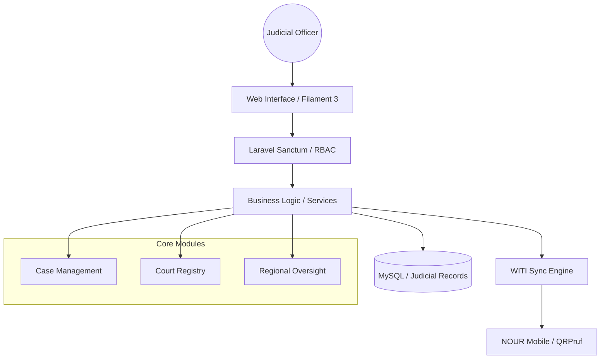

# Governance Platform Architecture 🏛️

This document outlines the architectural patterns and technical standards used in the **WITI Governance Platform**, the judicial administrative backbone for Morocco's bailiff corps.

## 📐 Architectural Philosophy

The platform is built on **Laravel 12** and **Filament 3**, favoring a **Productivity-First** approach while maintaining strict **RBAC (Role-Based Access Control)** and data integrity.

## 🛠️ Tech Stack

- **Framework:** Laravel 12 (PHP 8.4)
- **UI Engine:** Filament 3 (TALL Stack: Tailwind, Alpine.js, Laravel, Livewire)
- **Database:** MySQL 8.0 with spatial extensions for mission tracking.
- **Reporting:** PDF generation via Snappy/Wkhtmltopdf for official judicial documents.
- **i18n:** Full Arabic RTL support for court documentation.

## 🔐 Security Standards

1. **Granular RBAC:** Implementation of `spatie/laravel-permission` with custom middleware to handle 73 unique court jurisdictions.
2. **Audit Trails:** Every modification to judicial records is logged with timestamp, user ID, and original vs. new state.
3. **Data Residency:** Configured for high-trust environments requiring data sovereignty.

## 🔄 Integration Workflow

The Governance Platform acts as the single source of truth for the WITI ecosystem. It provisions mission data to **NOUR Mobile** and validates cryptographic proofs generated by **QRPruf**.
